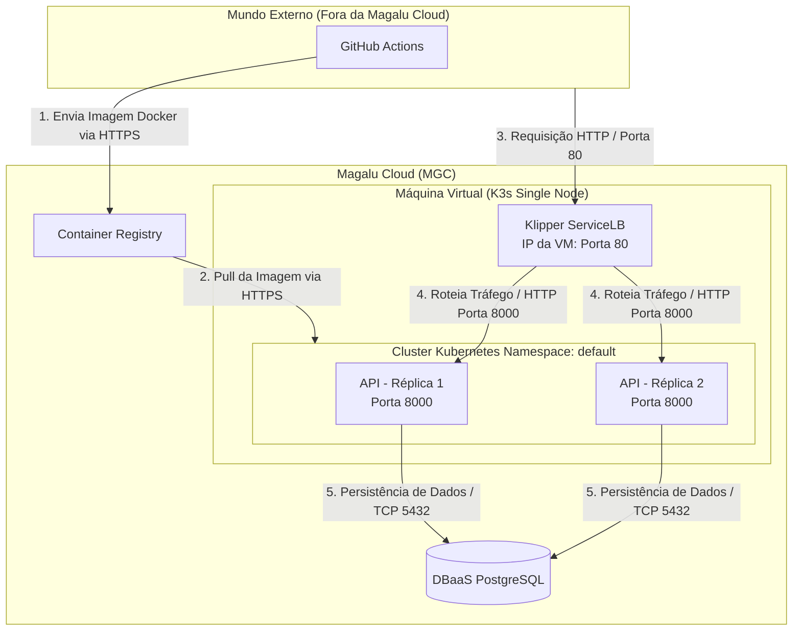

# Arquitetura da Solução - Monitoramento e Resiliência

## Diagrama da Arquitetura (Mermaid)

## Componentes da Arquitetura

| Componente | Serviço MGC | Função |
| :--- | :--- | :--- |
| **API** | K3s (VM BV2-2-40 single node) — 2 réplicas | Processa as requisições HTTP |
| **Banco de dados** | DBaaS PostgreSQL | Persiste pedidos e itens |
| **Imagens** | Container Registry | Armazena versões da aplicação |
| **Tráfego externo** | Klipper ServiceLB (IP da VM, porta 80) | Distribui entre as réplicas e fornece acesso externo |
| **CI/CD** | GitHub Actions | Automatiza testes, build e deploy |

## Requisitos Não-Funcionais

| Requisito | Como medir | Alvo |
| :--- | :--- | :--- |
| **Disponibilidade** | Erros 5xx e uptime das probes no Grafana | 99,5% mensal |
| **Latência** | `histogram_quantile(0.95, sum(rate(http_request_duration_seconds_bucket[5m])) by (le))` no endpoint `/metrics` | P95 < 500 ms |
| **Escalabilidade** | Teste de carga (k6) + verificando `rate(http_requests_total[5m])` | 300 req/s sem degradação |
| **Custo** | VM + DBaaS + IP Alocado calculados via plataforma MGC | Teto financeiro definido em ADR |

## Estilo Arquitetural

A solução implementada adota o estilo de **Monolito em Camadas** (Apresentação $\rightarrow$ Serviço $\rightarrow$ Dados). O deploy é consolidado em infraestrutura conteinerizada executando de forma resiliente em **duas réplicas simultâneas** sob gerência do K3s, garantindo tolerância a falhas localizadas e auto-recuperação (*self-healing*). Como estratégia de evolução (estilo-alvo), caso o domínio de notificações/eventos apresente gargalos de escalabilidade, a arquitetura prevê o desacoplamento desse componente em um microserviço especializado orientado a eventos.
