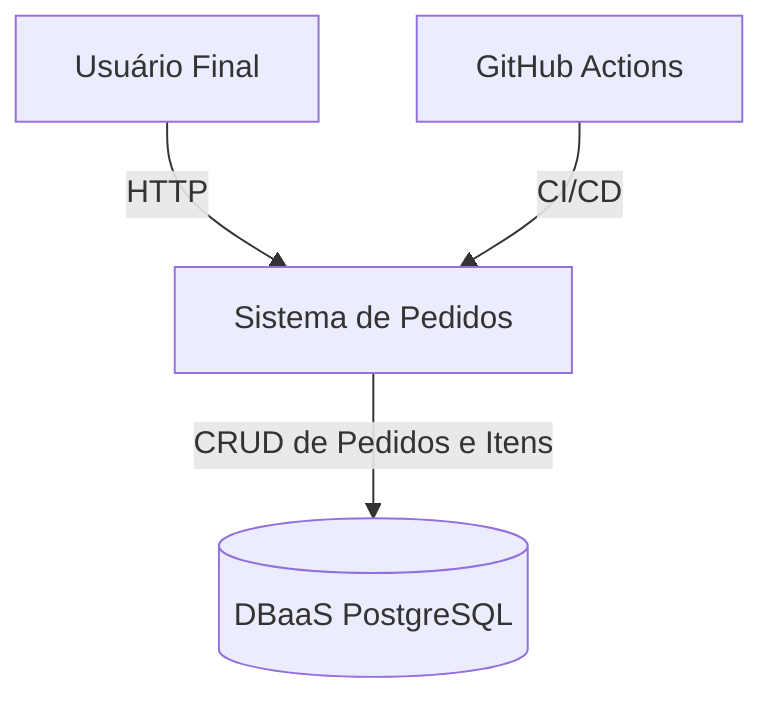
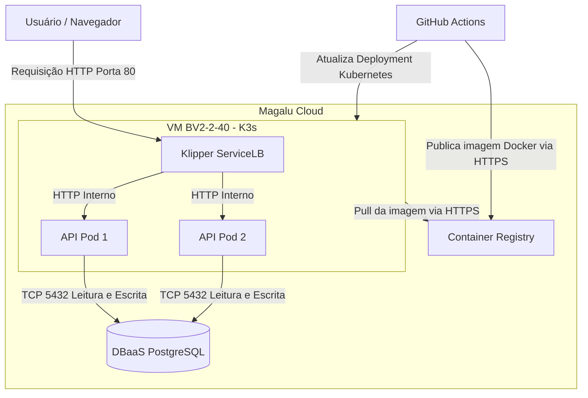

# Arquitetura da Solução

## Diagrama C1 - Contexto

---

## Diagrama C2 - Containers

---

## Componentes da Arquitetura

| Componente | Serviço | Função |
|------------|----------|---------|
| API | K3s (2 réplicas) | Processar requisições HTTP |
| DBaaS PostgreSQL | Banco Gerenciado | Persistir pedidos e itens |
| Container Registry | Registry MGC | Armazenar imagens Docker |
| Klipper ServiceLB | Balanceador de Carga | Distribuir tráfego entre pods |
| GitHub Actions | CI/CD | Automatizar build e deploy |

---

## Fluxo de uma Requisição

1. O usuário acessa a aplicação pelo navegador.
2. A requisição HTTP chega ao Klipper ServiceLB através do IP público da VM.
3. O balanceador encaminha a requisição para uma das duas réplicas da API.
4. A API processa a requisição.
5. Caso necessário, a API consulta ou grava dados no DBaaS PostgreSQL pela porta 5432.
6. O banco retorna os dados para a API.
7. A API devolve a resposta HTTP para o usuário.

---

## Requisitos Não Funcionais

| Requisito | Como medir | Alvo |
|------------|------------|-------|
| Disponibilidade | Erros 5xx e uptime das probes | 99,5% mensal |
| Latência | P95 das requisições | Menor que 500 ms |
| Escalabilidade | Teste de carga k6 | 300 req/s sem degradação |
| Custo | VM + DBaaS + Registry | Conforme orçamento definido nos ADRs |

---

## Estilo Arquitetural

A solução segue o estilo arquitetural de **Monólito em Camadas**, composto pelas camadas de apresentação, serviço e dados.

A aplicação é empacotada em um único container Docker e implantada em duas réplicas no cluster Kubernetes K3s.

O banco de dados é executado externamente através do serviço DBaaS PostgreSQL da Magalu Cloud.

---

## Estado Atual da Solução

- Cluster K3s executando em VM BV2-2-40.
- Duas réplicas da API.
- Banco de dados PostgreSQL gerenciado (DBaaS).
- Deploy automatizado por GitHub Actions.
- Imagens armazenadas no Container Registry.

---

## Limitações da Arquitetura

- Cluster executando em nó único (single node).
- Ponto único de falha na VM.
- Ausência de auto scaling.
- Sem HTTPS/TLS configurado.
- Dependência do DBaaS para persistência dos dados.
- Balanceamento limitado ao Klipper ServiceLB.
