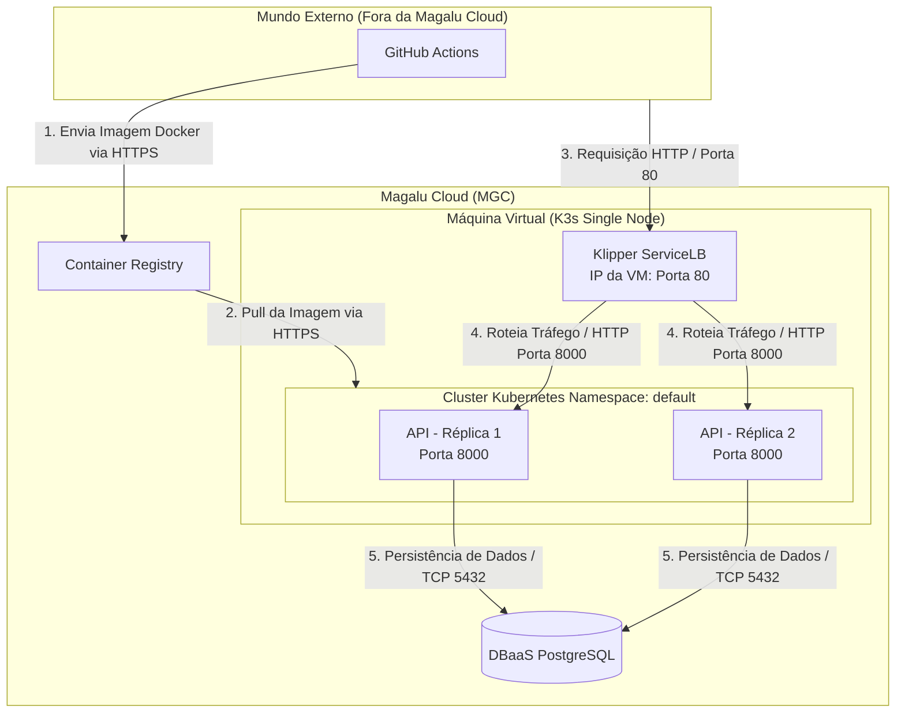

# Arquitetura da Solução - Monitoramento e Resiliência

## Diagrama da Arquitetura (Mermaid)

## Componentes da Arquitetura

| Componente | Serviço MGC | Função |
| :--- | :--- | :--- |
| **API** | K3s (VM BV2-2-40 single node) — 2 réplicas | Processa as requisições HTTP |
| **Banco de dados** | DBaaS PostgreSQL | Persiste pedidos e itens |
| **Imagens** | Container Registry | Armazena versões da aplicação |
| **Tráfego externo** | Klipper ServiceLB (IP da VM, porta 80) | Distribui entre as réplicas e fornece acesso externo |
| **CI/CD** | GitHub Actions | Automatiza testes, build e deploy |

## Requisitos Não-Funcionais

| Requisito | Como medir | Alvo |
| :--- | :--- | :--- |
| **Disponibilidade** | Erros 5xx e uptime das probes no Grafana | 99,5% mensal |
| **Latência** | `histogram_quantile(0.95, sum(rate(http_request_duration_seconds_bucket[5m])) by (le))` no endpoint `/metrics` | P95 < 500 ms |
| **Escalabilidade** | Teste de carga (k6) + verificando `rate(http_requests_total[5m])` | 300 req/s sem degradação |
| **Custo** | VM + DBaaS + IP Alocado calculados via plataforma MGC | Teto financeiro definido em ADR |

## Estilo Arquitetural

A solução implementada adota o estilo de **Monolito em Camadas** (Apresentação $\rightarrow$ Serviço $\rightarrow$ Dados). O deploy é consolidado em infraestrutura conteinerizada executando de forma resiliente em **duas réplicas simultâneas** sob gerência do K3s, garantindo tolerância a falhas localizadas e auto-recuperação (*self-healing*). Como estratégia de evolução (estilo-alvo), caso o domínio de notificações/eventos apresente gargalos de escalabilidade, a arquitetura prevê o desacoplamento desse componente em um microserviço especializado orientado a eventos.

## Análise de Trade-offs

| Aspecto | Decisão tomada | Alternativa não escolhida | Motivo da escolha |
| :--- | :--- | :--- | :--- |
| **Deploy** | K3s em VM | MKS (Kubernetes Gerenciado) | Custo menor, provisionamento < 2 min, manifests idênticos |
| **Banco** | DBaaS gerenciado | PostgreSQL em container | Backup automático, sem administração |
| **CI/CD** | GitHub Actions | Deploy manual | Consistência e rastreabilidade |
| **Réplicas** | 2 pods | 1 pod | Disponibilidade mínima sem custo excessivo |
| **API** | FastAPI (Python) | Node.js, Go, Java | Curva de aprendizado baixa, alta produtividade |

## Pontos de Melhoria e Próximos Passos

### Escalabilidade Horizontall e Próximos Passos
A aplicação possui arquitetura *stateless*, permitindo a escalabilidade horizontal simples através da adição de novas réplicas atrás do balanceador de carga. Atualmente, a arquitetura está fixada em 2 réplicas. 

O próximo passo evolutivo para o ambiente é a implementação do **HPA (Horizontal Pod Autoscaler)**, configurado para ajustar dinamicamente o volume de réplicas baseado na utilização de CPU (ex: mínimo de 2, máximo de 6 pods, com alvo de 70% de utilização). 

*Nota de Arquitetura:* É crucial registrar que o escalonamento horizontal da API não resolve gargalos na camada de dados. O **DBaaS PostgreSQL** escala predominantemente na vertical e tende a saturar antes da camada de aplicação caso o volume de requisições cresça indefinidamente.

### Roadmap de Evolução Técnica

| Melhoria | Por quê |
| :--- | :--- |
| **HTTPS / TLS** | Toda API em produção deve ser acessada de forma segura e criptografada por HTTPS. |
| **Autoscaler (HPA)** | Garante escala automatizada do ambiente sob picos sazonais de carga. |
| **Versionamento de API** | Uso de prefixos como `/v1/orders` permite evoluir o software sem quebrar os clientes legados. |
| **Rate Limiting** | Evita abusos e ataques de negação de serviço, protegendo a camada de banco de sobrecargas. |
| **Cache (Redis)** | Intercepta requisições repetidas na memória, reduzindo consultas redundantes ao PostgreSQL. |
| **Migrações de Schema (Alembic)** | Garante o controle de versão e rastreabilidade sobre as mudanças estruturais do banco. |
| **Testes de Carga** | Valida de forma proativa o comportamento e resiliência do ecossistema sob alto tráfego. |
| **Migração para MKS** | Transição mandatória para alta disponibilidade (HA) real da infraestrutura; os manifests YAML permanecem idênticos. |

### Custo Estimado na Magalu Cloud

Com base na tabela de precificação transparente e faturamento em Real (BRL) da plataforma Magalu Cloud, a composição de custos da infraestrutura atual envolve:

| Recurso | Especificação | Observação |
| :--- | :--- | :--- |
| **VM K3s** | BV2-2-40 (2 vCPU, 2 GB) | Instância Compute básica calculada e cobrada estritamente por hora de uso. |
| **DBaaS PostgreSQL** | Instância Pequena (Gerenciada) | Banco de dados relacional gerenciado, faturado por hora ativa de uso. |
| **Container Registry** | Armazenamento de Imagens | Custo marginal e otimizado para o armazenamento de imagens consolidadas com volumetria inferior a 500 MB. |

*(Os preços vigentes e atualizados podem ser validados oficialmente em: https://magalu.cloud/precos/)*
