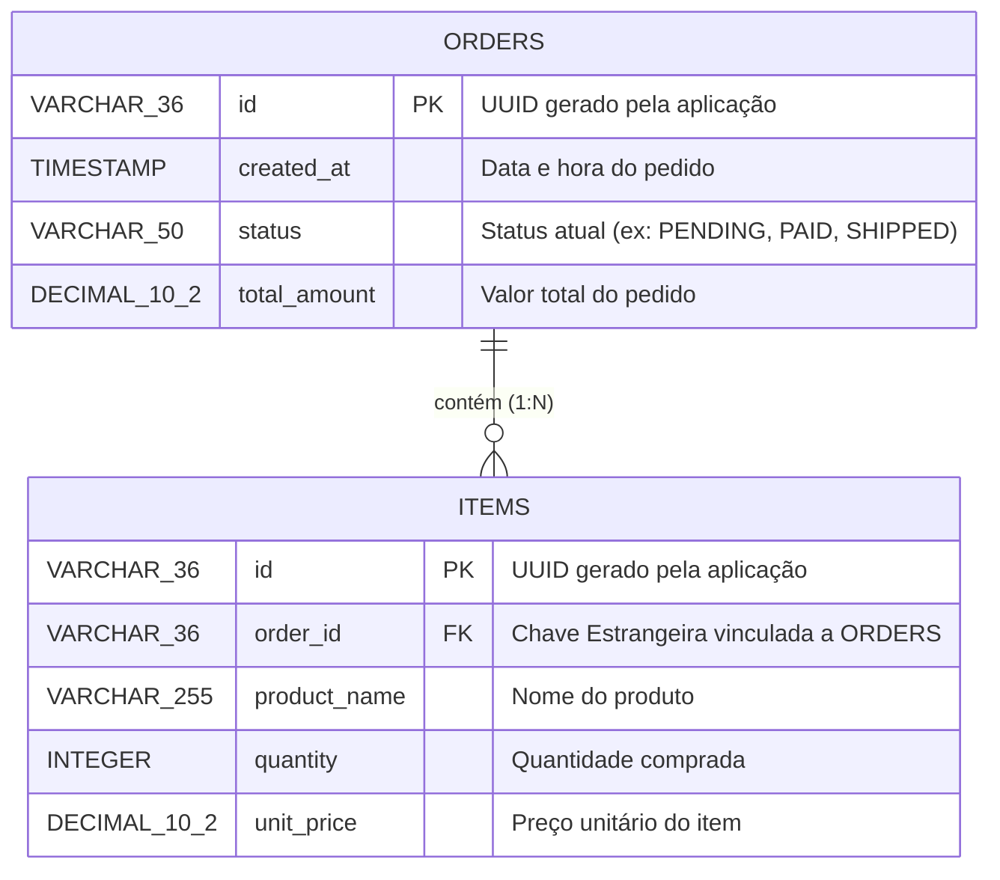

# 📊 Documentação de Modelagem de Dados

Este documento detalha o modelo relacional de dados da aplicação, especificando os tipos de dados compatíveis com **PostgreSQL** e as restrições de integridade.

---

## 🏗️ Diagrama Entidade-Relacionamento (ERD)

Abaixo está a representação visual do relacionamento entre as tabelas através da tecnologia Mermaid.

---

## 🗄️ Dicionário de Dados (Entidades)

### 📦 1. Pedido (`orders`)
Armazena as informações principais e o status do pedido de compra.

| Coluna | Tipo (SQL/PostgreSQL) | Restrições | Descrição |
| :--- | :--- | :--- | :--- |
| `id` | `VARCHAR(36)` / `UUID` | `PRIMARY KEY` | Identificador único universal do pedido. |
| `created_at` | `TIMESTAMP` | `NOT NULL`, `DEFAULT NOW()` | Carimbo de data/hora da criação do registro. |
| `status` | `VARCHAR(50)` | `NOT NULL` | Estado do pedido (ex: `PENDING`, `COMPLETED`, `CANCELED`). |
| `total_amount` | `DECIMAL(10, 2)` | `NOT NULL`, `>= 0` | Valor total financeiro somado do pedido. |

### 🧩 2. Item (`items`)
Armazena os produtos vinculados a cada pedido (Linhas do pedido).

| Coluna | Tipo (SQL/PostgreSQL) | Restrições | Descrição |
| :--- | :--- | :--- | :--- |
| `id` | `VARCHAR(36)` / `UUID` | `PRIMARY KEY` | Identificador único universal do item. |
| `order_id` | `VARCHAR(36)` / `UUID` | `FOREIGN KEY` | Vinculo com `orders(id)` com regra `ON DELETE CASCADE`. |
| `product_name` | `VARCHAR(255)` | `NOT NULL` | Nome comercial do produto adquirido. |
| `quantity` | `INTEGER` | `NOT NULL`, `> 0` | Quantidade de unidades compradas deste produto. |
| `unit_price` | `DECIMAL(10, 2)` | `NOT NULL`, `>= 0` | Preço cobrado por uma única unidade do produto. |

---

## 🔗 Relacionamentos e Regras de Negócio

* **Cardinalidade:** `1:N` (Um para Muitos). Um **Pedido** (`orders`) pode conter um ou vários **Itens** (`items`), mas um item pertence obrigatoriamente a apenas um pedido.
* **Integridade Referencial:** A coluna `order_id` na tabela `items` possui uma restrição de chave estrangeira apontando para `id` na tabela `orders`.
* **Cascata (`ON DELETE CASCADE`):** Caso um pedido seja deletado do sistema, todos os itens associados a ele serão removidos do banco automaticamente para evitar dados órfãos.

---

## 🚀 Engenharia e Estratégia de Persistência

As tabelas são mapeadas via **SQLAlchemy ORM (Python)** com migrações gerenciadas pelo **Alembic**.

1. **A aplicação lê o modelo:** As classes declarativas em `app/models.py` definem a estrutura lógica.
2. **Abstração do Banco:** O SQLAlchemy traduz as classes Python em tabelas nativas `DOCKER-POSTGRESQL`.
3. **Idempotência:** A criação e evolução do banco usam rotinas que verificam se as tabelas já existem antes de executar comandos `DDL`.
